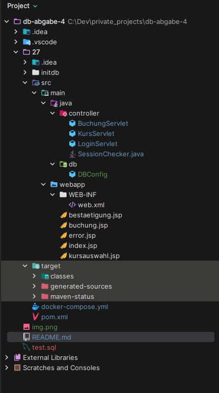
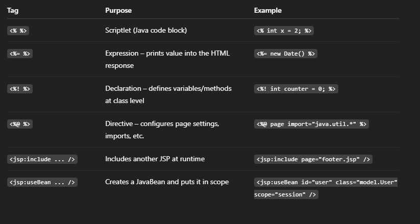

# Java JSP Web Application

This is a basic Java web application project generated using the Maven `maven-archetype-webapp` archetype.  
It uses JSP (JavaServer Pages) and is configured to run with an embedded Tomcat 9 Maven plugin.

## 📁 Project Structure

## ⚙️ Generate Project

This project was created using the following Maven command:

mvn archetype:generate -DarchetypeGroupId=org.apache.maven.archetypes -DarchetypeArtifactId=maven-archetype-webapp -DarchetypeVersion=1.4

src: https://code.visualstudio.com/docs/java/java-webapp

# to run locally with Jetty server, plugin was added in POMXL
run: mvn jetty:run

# cmd to start tomcat server locally: mvn tomcat9:run

.) Open your browser and navigate to: http://localhost:8080/

# 🧱 Build WAR

To build a .war file for deployment to a standalone server:
mvn clean package
This creates a target/<artifactId>.war file you can deploy to any Servlet container (e.g. Apache Tomcat).

📋 Requirements

.) Java 8 or higher

.) Maven 3.x

# Docker commands: 

# !!! WARNING: Deletes all database data, use with caution !!!

remove volumes:
* docker compose down -v

build command: 
* docker compose up --build

# #########################################################################################
# Typical dev loop: 

# Recompile WAR
mvn clean package

# Recreate containers with the fresh WAR
docker compose up --build

# Or in detached mode
docker compose up --build -d

# to ssh via cmd inside container: docker exec -it container_id bash

to access db server via cmd: psql -U user -d ausbildung_db

or for a Client use this plugin in vscode: https://marketplace.visualstudio.com/items?itemName=cweijan.vscode-postgresql-client2
(Intellij has similar plugin)

Host: localhost
Port: 5435
Database: ausbildung_db
User: user
Password: password

# For localhost (on your machine and not docker, use port 5435 or any other or if 5432 works, that's fine)

after adding this plugin, go to the UI and test the queries from: test.sql 

# Consider to learn basics of JSP and Servlets, for JSP here is a quick reference of the Tags: 

