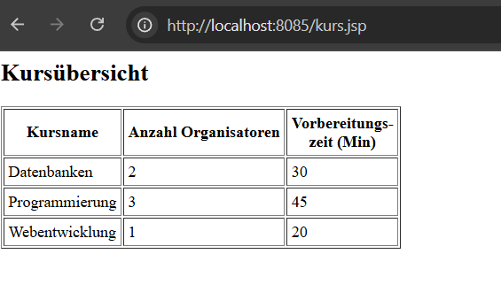

# TODO Pakete für jeden Team Mitglied werden hier abgebildet

Berkant: /initdb/init.sql

task1: Analyse statement:
CREATE TABLE Ausbilder_hat_Kurs (
Kursname VARCHAR(100),
Datum DATE,
Uhrzeit TIME,
Sprache VARCHAR(50),
PRIMARY KEY (Kursname, Datum, Uhrzeit),
FOREIGN KEY (Kursname) REFERENCES Kurs(Kursname)
-- Hinweis: Keine direkte Referenz auf Ausbilder vorhanden – möglicherweise ein Fehler im Modell
);

Dieser Kommentar: "-- Hinweis: Keine direkte Referenz auf Ausbilder vorhanden – möglicherweise ein Fehler im Modell"
-> Welche Auswirkung hat es auf das Gesamte Schema ? 

task2: test.sql

-> abfragen testen 

# Als Team zu machen: jsp files ANHAND von der Aufgabe1.doc - Aufgabe01.pdf erstellen bitte !!!

Ahmed hat gestern falsche Dateien für uns erstellt, zbs. gabs eine Buchung.jsp 

aber in euer SQL aufgabe gabs keine Buchungstabelle, ich meinte das sollst du dir nur 

als Vorlage hernehmen von seiner Seite und anhand von dem unsere Task generieren: 

# Ich HABE JETZT ZBS. FOLGENDES RICHTIG GEMACHT: 

Kurs.jsp anhand der Tabelle in SQL generiert und diese dann einfach eine Abfrage gemacht um das abzubilden:

WENN IHR ALSO DEN NETTY SERVER LOCAL STARTET (NICHT ÜBER DOCKER, NUR POSTGRES ÜBER DOCKER STARTEN):

SCHAUT SO AUS: 

DANN SOLLTET IHR SOWOHL index.jsp als auch beim routing zu kurs.jsp folgendes sehen:

AUFGABE ist ALSO ENTSPRECHEND mal richtige jsp files genererien: 
kurs.jsp und index.jsp passen so weit

ÜBERLEGT EUCH EINFACH MAL BITTE NE STRUKTUR WIE DIE APP AUSSCHAUEN SOLL,
ALSO MAN LANDET AUF index.jsp und welche Übersicht usw. gibt es ? etc. 

